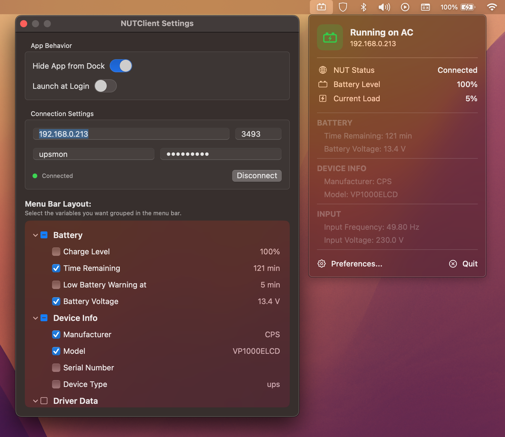

# NUT Client for macOS

A lightweight, fully native macOS menu bar app to monitor network UPS devices that communicate over your local network using the NUT (Network UPS Tools) protocol.

This project is a pure Swift/AppKit/SwiftUI port of the original Electron-based [vitaliystoyanov/nut-client](https://github.com/vitaliystoyanov/nut-client), designed to drop the heavy Chromium overhead and deliver a seamless, battery-friendly macOS experience.

--

### Features

* **100% Native:** Built with Swift, AppKit, and SwiftUI
* **Menu Bar Agent:** Sits quietly in your menu bar with a dynamic icon that changes based on your battery status (AC Power, On Battery)
* **Dynamic Variable Discovery:** Automatically detects all variables your specific UPS hardware supports (Voltages, Frequencies, Temperatures, Loads) and maps them into human-readable formats.
* **Highly Customizable:** Choose exactly which stats you want to see in your menu bar dropdown via the Preferences window
* **System Integration:**
  * Launch at Login support (on macOS 13+).
  * Toggle to hide/show the Dock icon natively.
* **Backward Compatible:** Supports macOS 12 (Monterey) and newer.

### Installation & macOS Gatekeeper

Because this is a free, open-source app without a paid Apple Developer signature, macOS will block it the first time you try to open it.

1. Attempt to open the app normally by double-clicking it. Click "OK" on the warning that pops up.
2. Open your Mac's **System Settings** and go to **Privacy & Security**.
3. Scroll down to the "Security" section. You will see a message saying *NUTClientNative was blocked*.
4. Click **Open Anyway**, enter your Mac password, and confirm.

 

